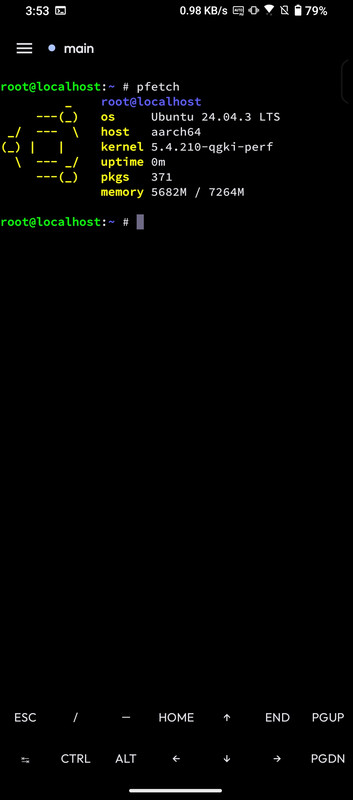
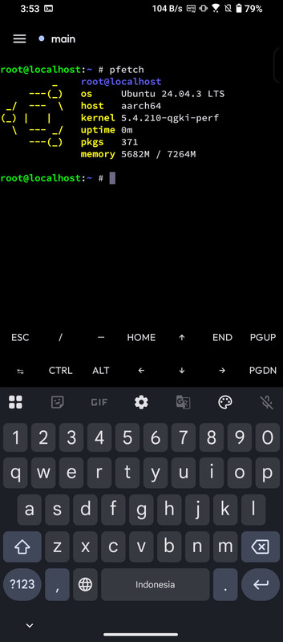
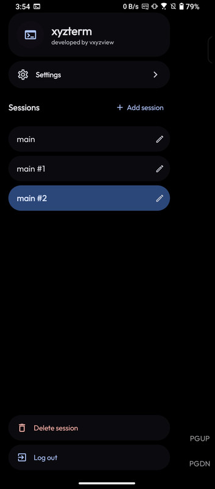
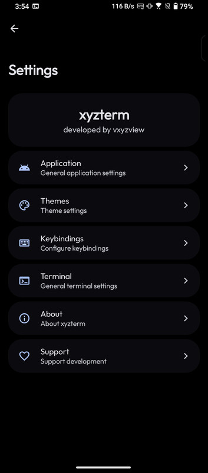
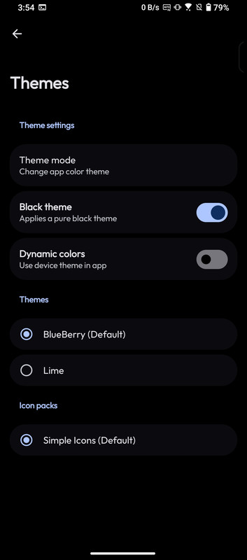
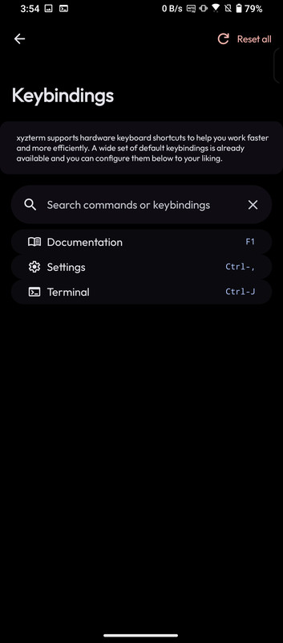

<div align="center">

```
██╗  ██╗██╗   ██╗███████╗████████╗███████╗██████╗ ███╗   ███╗
╚██╗██╔╝╚██╗ ██╔╝╚══███╔╝╚══██╔══╝██╔════╝██╔══██╗████╗ ████║
 ╚███╔╝  ╚████╔╝   ███╔╝    ██║   █████╗  ██████╔╝██╔████╔██║
 ██╔██╗   ╚██╔╝   ███╔╝     ██║   ██╔══╝  ██╔══██╗██║╚██╔╝██║
██╔╝ ██╗   ██║   ███████╗   ██║   ███████╗██║  ██║██║ ╚═╝ ██║
╚═╝  ╚═╝   ╚═╝   ╚══════╝   ╚═╝   ╚══════╝╚═╝  ╚═╝╚═╝     ╚═╝

   ████████
   █        █   a proot Linux shell in your pocket
   █  >_     █   terminal-only · no root · no telemetry
   █        █
   ████████
```

**xyzterm** is a minimal, terminal-only Android app that runs a real
[proot](https://github.com/termux/proot)-based Ubuntu environment with a full
terminal emulator. Tap, and you're in a shell — no code editor, no file
manager, no git UI, no extensions.

[](https://www.gnu.org/licenses/gpl-3.0.en.html)
[](https://f-droid.org/)
[](https://www.android.com/)

</div>

---

## ✦ Screenshots

<div align="center">








</div>

---

## ✦ Features

- **Real Ubuntu, no root** — proot userspace rootfs per ABI (`arm`, `arm64`, `x64`)
- **Full terminal emulator** — configurable font, size, colors, and an extra-keys row
- **Multiple named sessions** — add, rename, delete, switch; persisted across restarts
- **Terminal themes** — including AMOLED and dynamic color (Monet)
- **Session-safe** — sessions survive backgrounding and app restarts
- **F-Droid only** — free, GPL-3.0-or-later, zero telemetry

---

## ✦ Getting started

1. Install from [F-Droid](https://f-droid.org/) (or build it yourself, below)
2. Open **xyzterm** — on first launch, choose to install Ubuntu (a ~200–400 MB rootfs download for your device, once; can also be installed later from terminal settings)
3. Start typing. You're in a real Ubuntu shell

> Your files live on normal Android storage, bound into the container as `/home` and `/root`.

---

## ✦ Build

Choose one of the following build methods.

### Option 1: Build locally

Build the **debug APK** (signed with the included test key):

```bash
./gradlew assembleDebug
```

The compiled APK lands at:

```
app/build/outputs/apk/debug/app-debug.apk
```

### Option 2: Build with Docker

No Android SDK or JDK 21 installed? Build in a container:

```bash
DOCKER_BUILDKIT=1 docker build --target export-stage --output ./out .
```

The generated debug APK will be located at:

```
out/debug/app-debug.apk
```

---

## ✦ Docs

- [Keybinds](docs/KEYBINDS.md) — supported keyboard shortcuts
- [Contributing](docs/CONTRIBUTING.md) — how to help

---

## ✦ Privacy

xyzterm is built for the F-Droid-first crowd. The apk ships **only** through
[F-Droid](https://f-droid.org/), is licensed **GPL-3.0-or-later**, and contains
**no telemetry** and **no third-party analytics**. Your shell is your business.

---

## ✦ License

Distributed under the [GNU General Public License v3.0](/LICENSE), inherited from
the upstream [Xed-Editor](https://github.com/Xed-Editor/Xed-Editor) project.
